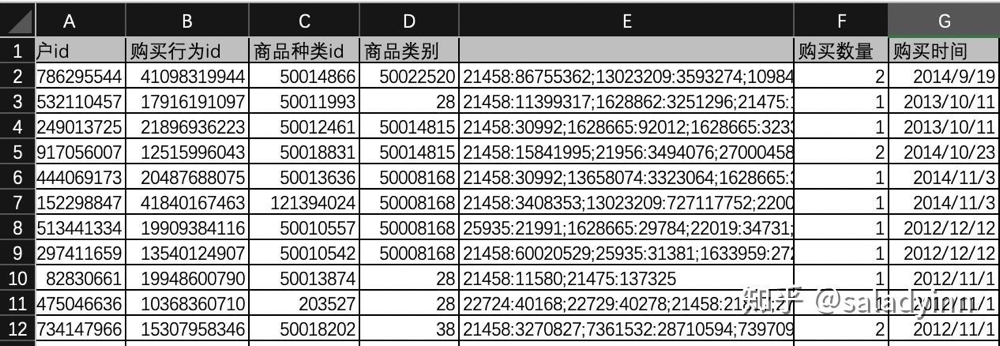

### 一、分析背景与目的
随着互联网、电子商务的发展，85后、90后年轻父母的孕育观念和消费行为不断升级，母婴电商以妈妈群体切入，以母婴商品为主要售卖品类蓬勃发展。

随着母婴电商市场进入高速发展期，市场竞争愈加激烈。期望通过对2012-2015年间淘宝和天猫提供的母婴商品数据进行诊断分析，对其存在的问题进行剖析，为后续的运营工作提供参考和指导。

### 二、理解数据
#### 1.数据源

数据来自淘宝和天猫上购买婴儿用品的用户，数据源：[Baby Goods Info Data-数据集-阿里云天池](https://link.zhihu.com/?target=https%3A//tianchi.aliyun.com/dataset/dataDetail%3FdataId%3D45)

数据集包含两个文件：
1）表1购买商品:（sample)sam_tianchi_mum_baby_trade_history

|用户id|商品id|商品种类id|商品类别|商品属性|购买数量|购买时间|
|---|---|---|---|---|---|---|
|745002413|	36815797313|	50023645	|28	|1628665:82340;21475:11488282;21458:56610575;49894306:4126700	|1	|2014/1/4	|
|249013725|	21896936223|	50012461|	50014815|	21458:30992;1628665:92012;1628665:3233938;1628665:3233942|	 1	|2013/10/11|
|1904323341|	37669194982|	211130|	50014815|	21458:3325996|	1	|2014/3/8	|
|14466144|	17610665576|	50011993|	28	|21458:104000;21475:137325|	1	|2013/3/27|
|691367866|	17712372914	|121434042|	50014815	|21458:49341152;8021059:5525523;6851452:13986690;6851452:7431151|	1	|2014/8/4	|
|605724983|	19747694834|	50006520|	50014815|	21458:30992|	12	|2014/10/17|
|82830661	|19948600790|	50013874|	28|	21458:11580;21475:137325|	1	|2012/11/1|
|475046636	|10368360710|	203527|	28	|22724:40168;22729:40278;21458:21817;2770200:24373989;2444468:17122099|	1	|2012/11/1|

2）表2婴儿信息:（sample)sam_tianchi_mum_baby

|user_id|birthday|gender|
|---|---|---|
|2757|	20130311|	1|
|415971|	20121111|	0|
|1372572	|20120130	|1|
|10339332|	20110910|	0|
|10642245|	20130213	|0|
|10923201|	20110830	|1|
|11768880|	20120107	|1|
|12519465	|20130705	|1|

#### 2.字段含义
1）表1购买商品（共包含29971条记录，7个字段）：

购买商品表（共包含29971条记录，7个字段）：

**user_id**：用户id，确定唯一一个用户

**auction_id（iterm_id）**：商品id

**cat_id**: 商品种类id，小类，如：卫衣，钱包等

**cat1**：商品类别，大类，如：卫衣之于服装，钱包之于箱包等

**property**：商品属性，描述一个商品具备的特征，如：大小、面料、尺码、款式等

**buy_amount**: 购买数量

**day**：购买时间，记录用户购买时间（时间戳格式）

2）婴儿信息表（共包含953条记录，3个字段）：

**user_id**: 用户id

**birthday**：出生日期（date）

**gender**：性别，婴儿性别（0：女性；1：男性；2未知）

### 三、分析思路

提出问题：

1.商品角度

1）各类目商品销量如何

2）店铺成交量随时间的波动情况

3）商品复购率如何

4）哪些商品最受

2.用户角度

1）不同年龄、性别对销量的影响

2）不同年龄、性别对商品的喜好

### 四、数据清洗
1.列名重命名

首先将列名改为中文便于后续分析

2.删除重复值

1）商品信息表：删除重复项（勾选用户id、商品id和购买时间列），无重复数据

2）婴儿信息表：删除重复项勾选（勾选全部列），未发现重复数据

3.缺失值

通过查找定位空值发现购买商品表中商品属性列存在空值（144个)，对未涉及到商品属性相关的业务问题不构成影响；婴儿信息表中不存在缺失值

4.一致化处理

1）通过分列将两表中时间相关的列设为日期形式

商品信息表：将购买时间设为日期形式

婴儿信息表：同上将出生日期列设为日期形式

2）将性别列中的编码用中文替代【=IF(C2=0,"女",IF(C2=1,"男","未知"))】，便于理解

婴儿信息表：替代性别编码

5.异常值处理

在商品信息表中添加出生日期和性别列，分别通过【=VLOOKUP(A2,'表2婴儿信息-清洗数据.csv'!$A$2:$D$954,2,0)】、【=VLOOKUP(A2,'表2婴儿信息-清洗数据.csv'!$A$2:$D$954,4,0)】拼接婴儿信息表中的出生日期和性别列

将商品信息表中添加年龄列，通过【=DATEDIF(H7,G7,"y")】得到年龄，降序排列，去除年龄为28岁的异常值

同时由于存在购买时间早于婴儿的出生时间导致【=DATEDIF(H7,G7,"y")】得到年龄会报#NUM！错误，然而这一业务场景是会在现实情况下出现的（用户在婴儿未出生时为婴儿提前购买用品），因此可以复制年龄列选择性粘贴为值到新一列，替换#NUM！为"未出生"

### 五、分析过程

1.各类目商品销量如何

商品类别id为28这类的商品销量最高，其次是50014815和50008168；在28类商品中，50011993类商品销量最高，50012788、50003700类次之，需注意商品库存

2.店铺成交量随时间的波动情况

1）年成交量分析

从图表可以看出2012到2014年成交量逐步增加，而在2015年销量骤减。结合上图中每月的销量表，2015销量低迷是由部分数据缺失导致

图中可以看出2012年只有1、2月份的数据，2015年只有7-12月份的数据，假设成立。因此得出结论：2012、2015年销量低迷的原因是由于部分数据缺失导致

2）月成交量分析

由图表可以看出每年第1、2月份销量低迷，5月、11月销量陡增。接下来分析每年1、2月份销量低迷的原因，假设1，2月份销量受春节的影响

由图表看出，2013年2月1日到2月15以及2014年1月26日到2月3日年销量很低，查询日历发现2013年2月10日、2014年1月31日是春节，考虑到春节期间用户的消费方式较平时回归传统，消费的主力如学生、青壮年也都回家过年、以及快递停运等原因，销量会趋于一个很低的水平，因此假设成立，1，2月份销量受春节的影响，销量很低。因此商家可以考虑采用节前节后打折促销的方式来提升销量。同时需要在节前做出长时间的运营节奏规划，从活动，推荐，站内流量路径等等方面入手，做好相关规划以及相应的资源准备。

接下来分析5月、11月销量陡增的原因，假设销量受到节日的影响。

2013年、2014年5.3日，5.10日、5.20日都同步出现销量小高峰，因此推测是店铺借着5月的劳动节、母情节以及即将来临的儿童节做促销活动，刺激销量增长。

由图看出2014年11月13日有一个异常峰值，核对数据发现11月13日有一位用户id为XX的用户购买了10061件商品，为了便于更清晰的观察11月份其他日期销量的变动，将该日的销量值使用该月的日平均销量代替，以便观察11月份其他日期的销量状况。

观察发现2012年11月10日、2013年11月11日和2014年11月11日出现销量高峰，因此推测商家在双11期间策划了促销活动，部分商家为避免双11期间订单暴增，错开双11选择在11月10日做促销活动。因此5月、11月由于各种节日的出现，商家借机做了促销活动以刺激销量增长，其中可能会出现其他原因，具体的结论需要跟相关部门人员沟通探讨后得到。

3.商品复购率如何

客户样本经过去除异常值以及去重处理，有29944人，其中25人重复购买，复购率为：25/29943 = 0.083%, 复购率很低，由此可见大部分销量都是由新用户带来的，至于复购率很低的原因究竟是产品原因、定价原因、渠道推动原因还是同行促销手段等原因，由于缺少相应的资源这里不做具体分析。下面从不同商品种类的角度细看复购率的情况：

各类商品的复购率都很低，要想维持业绩的增长，不进要关注新用户，更要关注老用户的存留和复购，数据有限暂且不作分析。

4.哪些商品最受欢迎

由图看出28、50014815、50008168三大类销量比较高，因此需要注意这三类商品的库存。为了进一步发现产品销量的趋势以及背后的原因，首先使用多维度分析方法根据：销量 = 人均消量 * 用户数公式，对销量指标进行分解：

图中28类、50014815类商品由于人均购买数量很高，购买用户数规模优秀的情况下导致销量也很高；而50008168类商品由于购买用户数庞大在人均销量一般的情况下导致销量比较高。38类商品在购买用户数很低的情况下，因为人均销量的保证使得总销量不至于很低，位于6大类商品中的中等水平。因此，38类商品有很大的发展空间。可以根据4p营销理论从产品、价格、渠道、促销等方面分析，由于数据缺乏，再次不做详细分析。

5.不同年龄、性别对销量的影响
1）不同性别对销量的影响

图表表明女婴对婴儿用品的需求量大约是男婴的两倍。平台可以针对性别进行精准推送。

2）不同年龄对销量的影响

随着年龄的增大婴儿用品的需求量逐步降低，其中0到3岁的幼儿对母婴商品的需求量比较高，0-1岁的需求量大约占据所有消费对象的一半，因此婴儿出生前后一年这一阶段母婴用品需求量最高，需注意库存。

6.不同年龄、性别对商品的喜好

1）不同年龄对商品的偏好

图中可以看出未出生以及年龄为0的婴儿对50014915类商品需求最高，对122650008类商品需求最低；1-4岁婴儿对50008168类商品需求最高，50022520类商品需求最低，因此可以对不同年龄的婴儿定向推荐商品。

2）不同性别对商品的偏好

男女婴对于28、5008168、50014815这三类商品的需求量都很大位居所有类别的top3，因此这三类商品很受婴儿欢迎；女婴对于50014815类的商品需求明显大于男婴，达男婴需求量的三倍左右，对28、38、50008168、1223650008类商品的需求也都大于男婴；男婴对50022520的需求大于女婴。因此可以对男女婴定向推送，如：50014815优先推荐给女婴，1223650008有限推送给男婴。

### 六、结论与建议

1.商品类别id为28的商品销量最高，也最受婴儿们的欢迎，可以考虑商品的生存周期、产品升级，同时也需要注重渠道的投放如门户新闻等，需要注意商品库存。

2.商品销量在春节期间由于节日购买习惯、快递停运等原因会趋于一个很低的水平，商家可以考虑采用节前节后打折促销的方式来提升销量。同时需要在节前做出长时间的运营节奏规划，从活动，推荐，站内流量路径等等方面入手，做好相关规划以及相应的资源准备。

3.每年的5月、11月由于节日密集，商家纷纷采取各类促销活动，因此在策划促销活动时，需要把握促销的时机、时长、频率以及强度，切勿盲目突然降价，降低用户对产品的认知。

4.婴儿商品复购率很低，可以从产品、定价、渠道以及促销等维度展开分析，判断商品是否符合用户的需求，以及是否做好客户关系维护。用数据找出用户可能复购（东西差不多用完了或改换了）的时间点，进行比较精准的营销，用数据指导营销。

5.商品类别id为38、50014815的商品在购买用户数很低的情况下，因为人均销量的保证使得总销量不至于很低，位于6大类商品中的中上水平。因此，38类、50014815类商品有很大的发展空间。可以根据4p营销理论从产品、价格、渠道、促销等方面分析以扩大用户规模。

6.女婴对婴儿用品的需求量大于男婴；婴儿商品销量集中在0到3岁，因此婴儿出生前后一年这一阶段婴儿用品需求量最高，店铺可以对这类群体定向推送产品。

7.不同性别的婴儿对不同类别的商品需求也有所不同，如可以将50014815类商品优先推荐给女婴，1223650008类商品优先推送给男婴。

